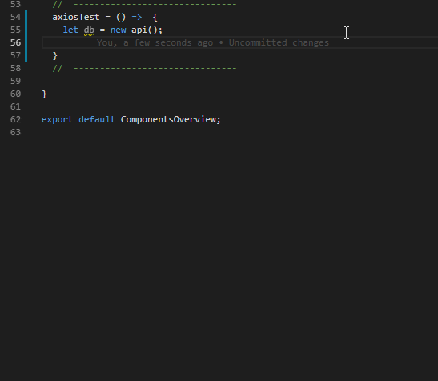
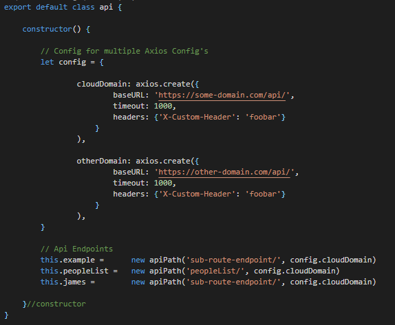

# Frontend REST API for Axios Using Object Oriented-Programming with Redux and Vuex

Here I have tryed to use OOP, to do axios request to the server. 

Design goals where:
- Autocomplete on any route in VsCode,see example.
- No "magic string" and try to remember how to write a route name, later in the project.
- Reuse methods, write once, use on every route.
- Ex. when you write a get method for the database, it can be reused for all routes.
- Not having thousands of lines with axios functions.

Here is how a request would look instead:

```
db.peoples.getAll();
db.peoples.getId(20);
db.peoples.post(...);
db.peoples.update(...);
```

The response from the axios/fetch will go directly to redux/vuex,


Autocomplete:



Define the domain & route endpoints:


